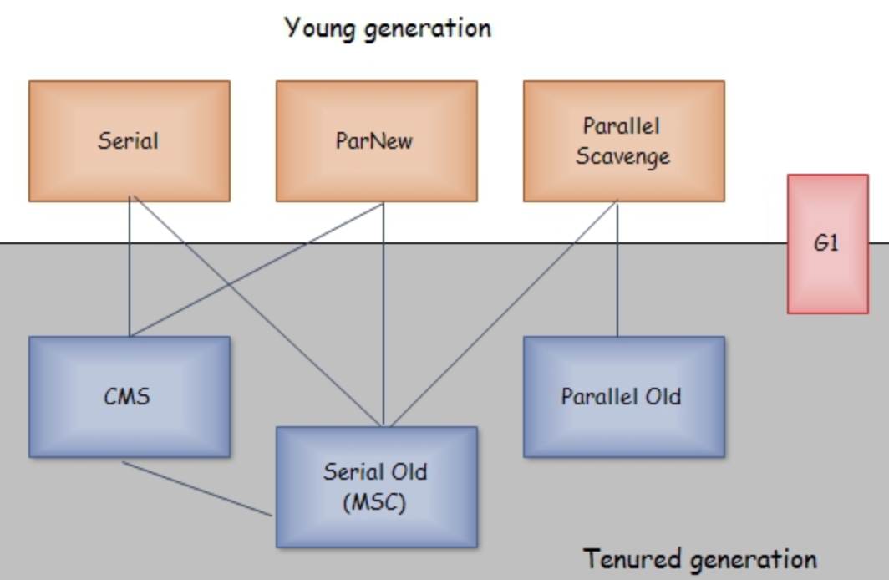

## 对象存活判定算法
**判断内存对象是否存活**的算法有：
- 引用计数算法
- 可达性分析算法
### 引用计数算法
使用对象中的引用计数器来记录该对象的被引用数。当计数器值为0，说明该对象没有被引用，可以被回收。

优点：
- 实现简单
- 判定效率高
缺点：
- 很难解决对象之间相互循环引用的问题，所以主流的java虚拟机没有采用该算法

应用案例：
- 微软公司的COM技术
- 使用actionscript 3的flashplayer
- python语言
- 游戏脚本领域广泛应用的Squirrel
### 可达性分析算法
通过一系列被称为**GC Roots**的对象作为起始点，从这些节点开始向下搜索，当一个对象不再GC Roots的引用链中，证明此对象是不可用的。

java中，可作为GC Roots的对象包括
- 虚拟机栈中引用的对象
- 方法区中类静态属性引用的对象
- 方法区中常量引用的对象
- 本地方法栈中JNI（即一般说的Native方法）引用的对象

## 引用的分类
引用可以分为4种
- 强引用，最普遍的一种，只要有强引用，垃圾收集器就不会回收掉被引用的对象。
- 软引用，描述一些有用但非必需对象，在内存溢出之前，会将这些对象进行回收。软引用常用来设计缓存。
- 弱引用，也是描述一些非必需对象，被弱引用关联的对象只能生存到下一次垃圾回收之前。
- 虚引用，对生存时间无影响，也无法通过虚引用来取得一个对象实例。

## 垃圾收集算法

### 标记-清除算法（Mark-Sweep）
算法分为**标记**和**清除**两个阶段。

该算法的不足：
- 效率问题，标记和清除两个阶段效率都不高。
- 空间问题，清除后产生很多碎片，如果分配大对象，无法找到足够连续内存。

### 复制算法(Copying)
算法过程：
- 内存分为大小相等的两块，每次只使用一块
- 当一块用完了，就将生存着的对象复制到另外一块上，然后这一块内存清理掉

优点：
- 实现简单
- 运行高效

缺点：
- 内存使用率不高

应用：
现在的商业虚拟机都是采用这种算法来回收**新生代**，因为大部分新生代中的对象都是*朝生夕灭*。
Eden和Survivor区的默认比例是8：1，如果Survivor的内存不够用，需要依赖老年代内存进行**分配担保**。

### 标记-整理算法（Mark-Compact）
当对象存活率较高时，复制算法需要复制较多的对象，效率就会降低。
算法分为**标记**和**整理**两个阶段，在整理阶段，让所有存活的对象都向一端移动，避免了碎片问题。

### 分代收集算法
把java堆分为新生代和年老代，新生代里大部分对象都是*朝生夕灭*，所以选用复制算法，年老代因为对象存活率高，没有额外空间对它进行**分配担保**，所以就使用**标记-清除**或者**标记-整理**算法

## HotSpot算法实现
### 枚举根节点
在确保一致性的快照中从GCRoots节点开始进行可达性分析。
这个行为会导致Stop the world，即停顿。
也就是说一旦进行了可达性分析，就会发生STW，而所有的GC都需要进行可达性分析。

### 安全点 & 安全区域
在安全点时，将对象引用存放到OopMap的数据结构，供枚举根节点使用。

GC时让所有线程跑到安全点有两种方案
- 抢先式中断，首先将所有线程中断，如果发现某线程不在安全点上，就恢复该线程，让它跑到安全点上。
- 主动式中断，设置一个标志，各个线程主动轮询该标志，发现中断标志就挂起自己。

安全区域是指一段代码片段之中，引用关系不会发生变化。用来解决某些线程处于sleep或者block状态，无法响应JVM中断请求走到安全点。

## 垃圾收集器
主要讨论HotSpot虚拟机，各垃圾收集器之间的关系如图所示，如果有连线，表示可以搭配使用。

新生代垃圾收集器：Serial，ParNew，Parallel Scavenge，都是使用了**复制**算法。

老年代垃圾收集器：Serial Old，Parallel Old，使用了**标记-整理**算法，而CMS使用了**标记-清除**算法。

### Serial收集器
**Client模式**下的默认**新生代**收集器，简单而高效，在单cpu或内存不多的情况下，效果很好

### ParNew收集器
就是Serial的多线程版本
**Server模式**下首选的**新生代**收集器
它是除Serial以外，唯一能与CMS配合工作的新生代收集器。
当选择了CMS时，ParNew是默认**新生代**收集器。

### Parallel Scavenge收集器
它提供了两个参数用于精确控制吞吐量
- -XX:MacGCPauseMillis控制最大垃圾收集停顿时间
- -XX:GCTimeRatio设置吞吐量

经常被称为**吞吐量优先**收集器，同时具有GC自适应调节策略，这也是其与Serial和ParNew的重要区别

### Serial Old
Serial收集器的老年代版本，Client模式下的**老年代**默认收集器

### Parallel Old
Parallel Scavenge收集器的老年代版本
在注重吞吐量和CPU资源敏感的场合，可以优先考虑Parallel Scavenge + Parallel Old收集器

### CMS
CMS(Concurrent Mark Sweep)收集器是一种以最短回收停顿时间为目标的收集器。使用了**标记-清除**算法。
整个过程包含4步
- 初始标记（CMS initial mark），STW，标记GC Roots能直接关联的对象，时间最短。
- 并发标记（CMS concurrent mark），GC Roots Tracking的过程，时间长。
- 重新标记（CMS remark），STW，修正标记记录，时间稍长。
- 并发清除（CMS concurrent sweep）

优点：
- 并发收集，低停顿

缺点：
- 当收集过程中出现内存不够用，启用Serial Old收集器，效率降低。
- 标记-清除导致碎片，导致Full-GC

### G1收集器
它将整个java堆划分为多个大小相等的独立区域，后台维护一个列表，每次根据允许的收集时间，优先回收价值最大的Region。
在大内存情况下可能会是一个好的选择
它有如下特点：
- 并行与并发
- 分代收集
- 空间整合
- 可预测的停顿

